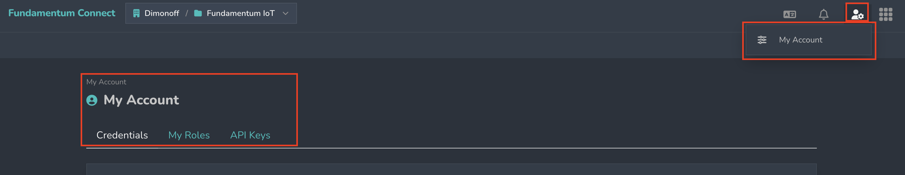

# My account

The **“My Account”** page contains all the information related to your personal account:

* **Credentials** allows you to update your name, Email, language and password.
* **My roles** display the different roles that have been assigned to you on the platform.
* **API keys** can be used with other services to authenticate and make requests.

<figure><figcaption></figcaption></figure>
