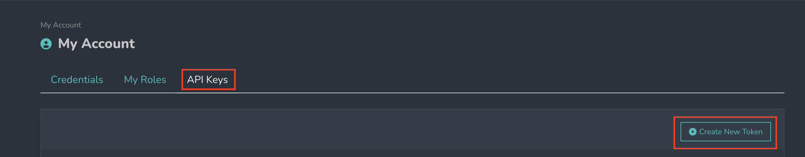
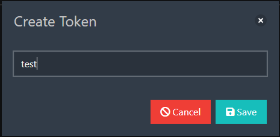
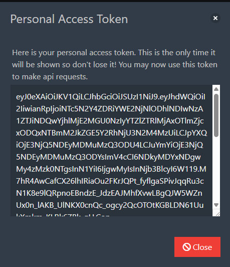

# API keys

This section is primarily intended for developers who wish to use the Fundamentum API client.

API keys enable application authentication when accessing APIs.

They are used to track usage, control access, limit data rates, and facilitate integration.

## Creating a new key

1. Click on the **Create new token** button.

<figure><figcaption></figcaption></figure>

2. Give the key a name.

<figure><figcaption></figcaption></figure>

3. Click on **Save**.

A unique key is generated.

<figure><figcaption></figcaption></figure>

⚠️ **Important**: copy the key immediately after creating it — it will no longer be visible afterward for security reasons.