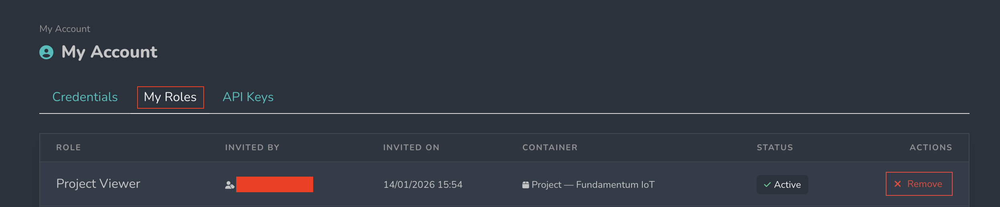

# My roles

The **“My Roles”** section displays information related to the access rights and permissions assigned to the user on Fundamentum.\
It allows you to view which role is currently associated with your account, who assigned it, as well as your account status and invitation details.

<figure><figcaption></figcaption></figure>

**Roles**: These are sets of permissions that can be assigned to users.
Platform administrators can manage system roles, which can be assigned to administrators.

Here are the default system roles available in Fundamentum:

* Project Managers can manage project roles, which can be assigned to users of that project.
* License Managers can manage license roles, which can be assigned to users of that license.

**Invited by**: Refers to the person who assigned this role to the user.

**Invited on**: Refers to the date and time when the role was assigned.

**Container**: Refers to the container the role applies to (project, license, etc.).

**Status**: Indicates the state of the assigned role. An **Active** role is assigned and in effect.

**Actions**: Lets you manage the assigned role.
