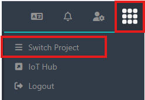
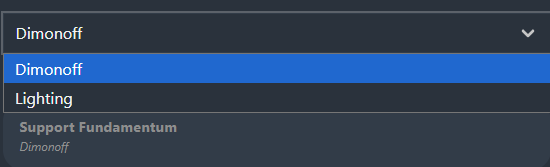
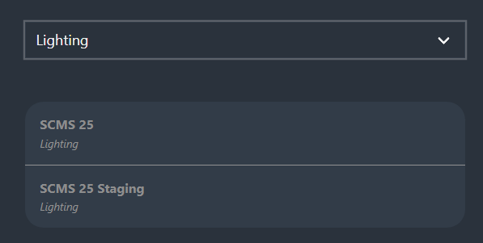

# Switch project

The **Switch Project** feature, accessible from the cube icon, allows users to switch between projects, provided they are invited and a member of those projects.

**Steps:**

1. Click on the cube icon in the settings bar.

2. Select the **Switch Project** option.

<figure><figcaption></figcaption></figure>

3. Open the drop-down list to view all available organizations.

<figure><figcaption></figcaption></figure>

4. Select the desired organization to display the projects it contains.

5. Click on the project you want to access.

<figure><figcaption></figcaption></figure>