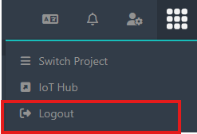

# Logout

The Logout function allows you to quickly exit the application from the cube-shaped icon.

**Steps:**

1. Click on the cube icon.
2. Select **Logout**.

<figure><figcaption></figcaption></figure>

You will be redirected to the login page.

<figure><figcaption></figcaption></figure>
