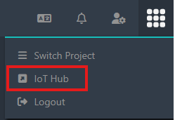
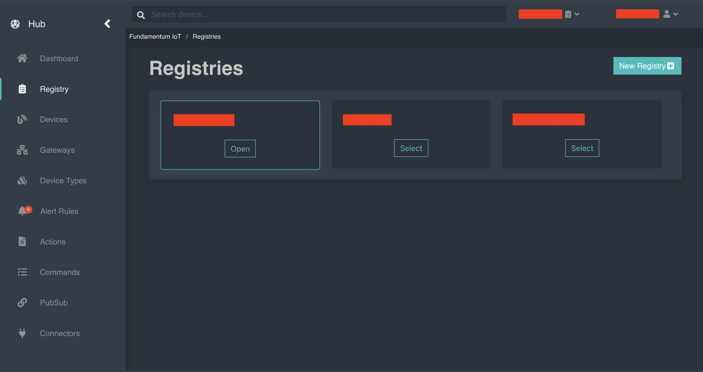

# IoT Hub

The IoT Hub feature, accessible from the cube icon, allows the user to switch to the HUB application.

**Steps:**

1. Click on the cube icon in the settings bar.
2. Select the IoT Hub option from the menu.

<figure><figcaption></figcaption></figure>

3. The user is automatically redirected to the HUB application, which provides access to the project's IoT device management: Registry, Devices, Gateways, Device Types, Alert Rules, Actions, Commands, PubSub, and Connectors, available from the side menu.

<figure><figcaption></figcaption></figure>
