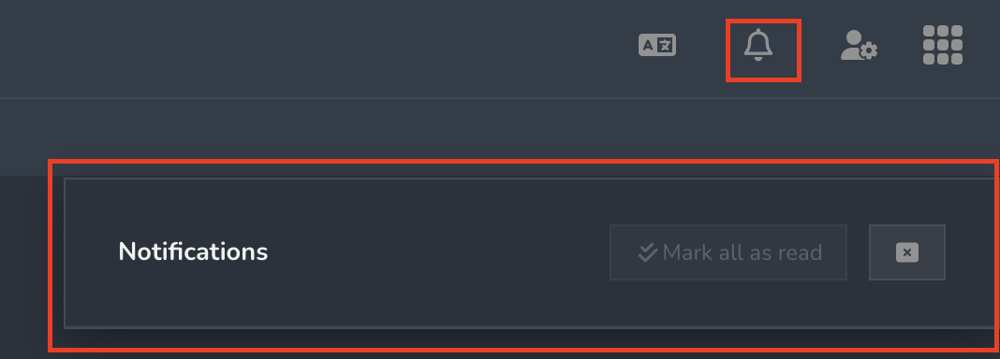

# Notifications

The notification icon (bell) is located near the top right corner of the window and is used to alert the user to important new information.

<figure><figcaption></figcaption></figure>
