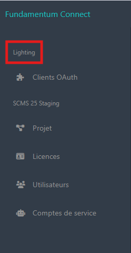

# Organization

An organization allows you to structure and manage resources, permissions, and data specific to each entity. It also facilitates member collaboration, access rights management, and the customization of settings within the organization.

<figure><figcaption></figcaption></figure>

Fundamentum includes several layers of data that support multi-level management and integration with various other types of systems.

<figure><figcaption></figcaption></figure>
